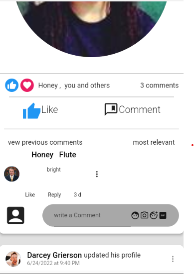

# calculator

##        Static User Profiles like Facebook

#  Created this app  for practice while learning flutter
  
This app contains some random user profiles (upto 30 users)
with data dowloaded from randomuser.me in json format

##  and the list continues...